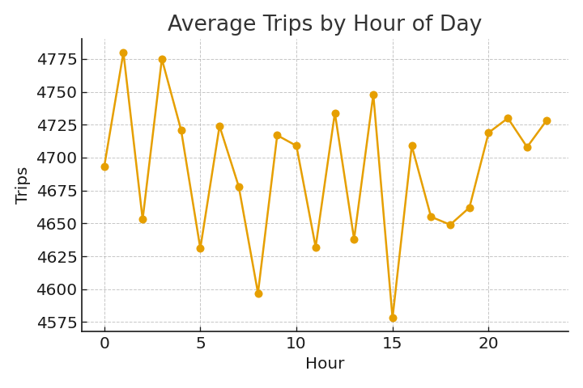
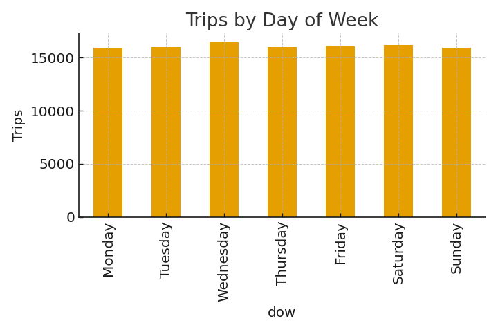
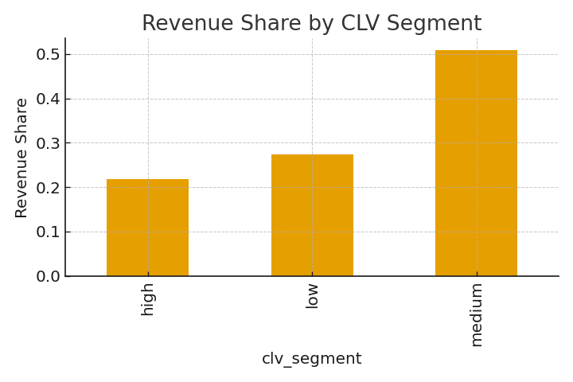

# Mobility Analytics – Demand Seasonality & Customer Lifetime Value (CLV) 🚕📊

**Author:** Luis Chaumer  
**Role:** Data Analyst  
**Tools:** Python, SQL (SQLite), Pandas, NumPy, Matplotlib, Jupyter Notebook  
**Dataset:** Synthetic — 112,568 trips & 30,000 customers  
**Period:** May 2024 – May 2025  

---

## 📘 Project Overview

This project analyzes **mobility demand patterns** and **customer lifetime value (CLV)** in a fictional ride-hailing platform.

Using a synthetic dataset of **112,568 trips** across **5 regions**, the goal is to:

- Understand daily, weekly, and hourly demand seasonality  
- Identify high-value customer segments  
- Analyze revenue concentration  
- Apply SQL queries for data exploration  
- Provide insights to improve operations, scheduling, and customer retention  

The analysis mimics real workflows used by data teams in ride-hailing, mobility, and transportation analytics.

---

## 🎯 Project Objectives

### **Demand Forecasting & Seasonality**
- Trips by hour of day  
- Trips by day of week  
- Daily trip volume trend  
- Identification of peak hours and low-demand periods  

### **Customer Lifetime Value (CLV)**
- Customer revenue and frequency aggregation  
- Recency & tenure metrics  
- CLV segmentation (Low / Medium / High)  
- Revenue share per segment  

### **SQL Analytics**
- Trips by region & weekday  
- Average revenue by CLV segment  
- High-value customer concentration  

---

## 📊 Dataset Description

### **Trips dataset (`mobility_trips_dataset.csv`)**
Includes 112,568 synthetic ride records:

- `trip_id`  
- `customer_id`  
- `trip_datetime`  
- `region`  
- `ride_type` (standard / premium / pool)  
- `distance_km`  
- `duration_min`  
- `price`  
- `rating`  

### **Customer aggregates (`mobility_customers_agg.csv`)**
Includes 30,000 unique customers:

- `customer_id`  
- `trips`  
- `total_revenue`  
- `avg_price`  
- `first_trip`  
- `last_trip`  
- `recency_days`  
- `tenure_days`  
- `trips_per_month`  
- `clv_segment`  

---

# 📈 Demand Seasonality Analysis

### **Daily Trips Over Time**

### **Trips by Hour of Day**

### **Trips by Day of Week**

---

# 🧮 Customer Lifetime Value (CLV)

### **Revenue Share by CLV Segment**

**Key Observations:**
- High-value customers represent a small share of the userbase but generate a large share of revenue.  
- Medium CLV users present strong potential for targeted upselling.  
- Low-value customers dominate volume but contribute minimally to revenue.

---

# 🗄 SQL Analysis (SQLite)

### **Trips by Region & Weekday**

SELECT 
    t.region,
    t.dow,
    COUNT(*) AS trips
FROM (
    SELECT 
        region,
        CASE strftime('%w', trip_datetime)
            WHEN '0' THEN 'Sunday'
            WHEN '1' THEN 'Monday'
            WHEN '2' THEN 'Tuesday'
            WHEN '3' THEN 'Wednesday'
            WHEN '4' THEN 'Thursday'
            WHEN '5' THEN 'Friday'
            WHEN '6' THEN 'Saturday'
        END AS dow
    FROM trips
) t
GROUP BY t.region, t.dow
ORDER BY t.region, trips DESC;

Average Revenue by CLV Segment
SELECT 
    clv_segment,
    COUNT(*) AS customers,
    ROUND(AVG(total_revenue), 2) AS avg_revenue,
    SUM(total_revenue) AS total_revenue
FROM customers
GROUP BY clv_segment
ORDER BY total_revenue DESC;

High-Value Customers by Region
SELECT 
    t.region,
    COUNT(DISTINCT c.customer_id) AS high_value_customers,
    SUM(c.total_revenue) AS total_revenue
FROM customers c
JOIN trips t
  ON c.customer_id = t.customer_id
WHERE c.clv_segment = 'high'
GROUP BY t.region
ORDER BY total_revenue DESC;

🚀 Key Insights
🔹 Demand

Clear morning and evening peaks, ideal for driver scheduling optimization

Weekends show different demand profiles vs weekdays

Daily volume trends suitable for forecasting

🔹 Customer Value

Revenue is heavily concentrated in high-value users

Medium CLV customers drive strong frequency → ideal upsell target

Region differences suggest tailored marketing

💡 Recommendations

Optimize driver supply according to hourly demand peaks

Create loyalty programs targeting medium & high CLV users

Use CLV for marketing acquisition (lookalike audiences)

Introduce premium features in high-value regions

Build a forecasting model (ARIMA/Prophet) to extend this analysis

📁 Repository Structure
demand_seasonality_e_customer_lifetime_value/
├── data/
│   ├── mobility_trips_dataset.csv
│   └── mobility_customers_agg.csv
├── images/
│   ├── daily_trips.png
│   ├── trips_by_hour.png
│   ├── trips_by_dow.png
│   └── clv_segments.png
├── mobility_demand_clv_analysis.ipynb
└── README.md

📬 Contact

Luis Chaumer
Data Analyst
📩 Email: luischaumer@gmail.com
🔗 LinkedIn: https://www.linkedin.com/in/luis-chaumer123
